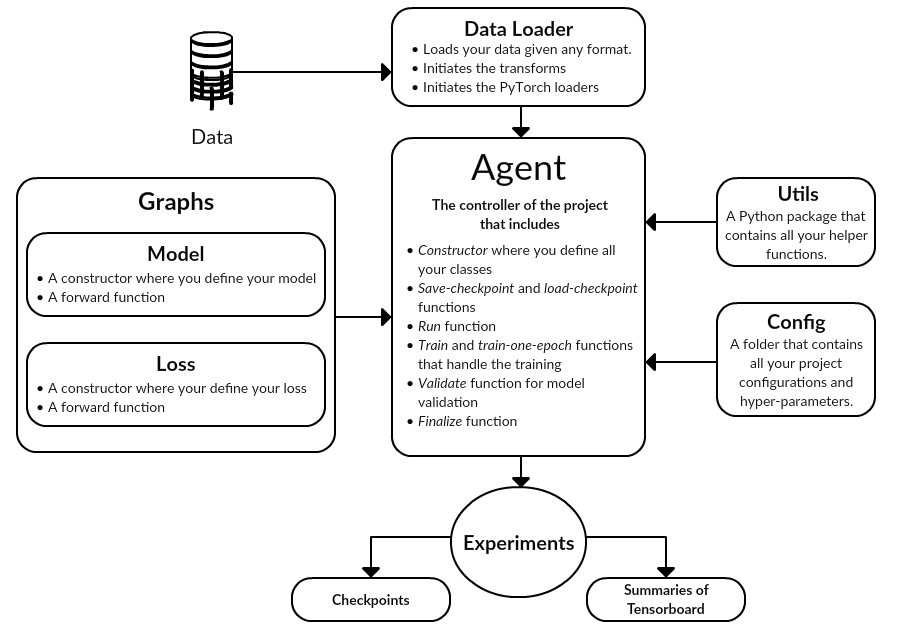

# This is a pure and scalable PyTorch verison of Fernie


# Usage
## Train
```
./main.py --config configs/fernie_kernie.json
```
## Predict
```
./main.py -w predict -i /y/Aurora/Fernie/data/structure_based_data/MUV_feature/MUV.Kinase.undersample.pickle -o /y/Aurora/Fernie/debug/MUV_kinase.csv -c /y/Aurora/Fernie/debug/pure_pytorch/experiments/Kernie/checkpoints/model_best.pth.tar
```